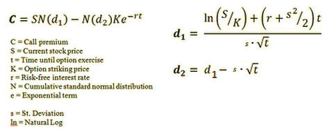

# pyOptionPricing
- use python 2.7
- if this project helps you reduce the time to develop, you could buy me a cup of coffee :)[](https://paypal.me/boyac?locale.x=en_US)


---
### Traditional Historical Volatility Calculation


```python
# -*- coding: utf-8 -*-
# @Author: boyac
# @Date:   2016-05-02 18:28:28
# @Last Modified by:   boyac
# @Last Modified time: 2016-05-02 19:09:29

from pandas import np
import pandas_datareader.data as web

def historical_volatility(sym, days): # stock symbol, number of days
    "Return the annualized stddev of daily log returns of picked stock"
    try:
        # past number of 'days' close price data, normally between (30, 60)
        quotes = web.DataReader(sym, 'yahoo')['Close'][-days:] 
    except Exception, e:
        print "Error getting data for symbol '{}'.\n".format(sym), e
        return None, None
    logreturns = np.log(quotes / quotes.shift(1))
    # return square root * trading days * logreturns variance
    # NYSE = 252 trading days; Shanghai Stock Exchange = 242; Tokyo Stock Exchange = 246 days?
    return np.sqrt(252*logreturns.var()) 
    
    
if __name__ == "__main__":
    print historical_volatility('FB', 30) # facebook: 0.296710526109
```


### Garman-Klass Historical Volatility

```python
# -*- coding: utf-8 -*-
# @Author: boyac
# @Date:   2016-05-02 18:28:28
# @Last Modified by:   boyac
# @Last Modified time: 2016-05-02 19:09:29

from pandas import np
import pandas_datareader.data as web


def gk_vol(sym, days):
    """"
    Return the annualized stddev of daily log returns of picked stock
    Historical Open-High-Low-Close Volatility: Garman Klass
    sigma**2 = ((h-l)**2)/2 - (2ln(2) - 1)(c-o)**2
    ref: http://www.wilmottwiki.com/wiki/index.php?title=Volatility
    """

    try:
    	o = web.DataReader(sym, 'yahoo')['Open'][-days:] 
    	h = web.DataReader(sym, 'yahoo')['High'][-days:] 
    	l = web.DataReader(sym, 'yahoo')['Low'][-days:] 
        c = web.DataReader(sym, 'yahoo')['Close'][-days:]
    except Exception, e:
        print "Error getting data for symbol '{}'.\n".format(sym), e
        return None, None
    sigma = np.sqrt(252*sum((np.log(h/l))**2/2 - (2*np.log(2)-1)*(np.log(c/o)**2))/days)
    return sigma
    
    
if __name__ == "__main__":
    print gk_vol('FB', 30) # facebook: 0.223351260219
```


### Black-Scholes Model

```python
# -*- coding: utf-8 -*-
# @Author: boyac
# @Date:   2016-05-02 18:28:28
# @Last Modified by:   boyac
# @Last Modified time: 2016-05-04 00:27:52

from scipy.stats import norm
from math import *

# Cumulative normal distribution
def CND(X):
    return norm.cdf(X)

# Black Sholes Function
def BlackScholes(CallPutFlag,S,K,t,r,s):
    """
    S = Current stock price
    t = Time until option exercise (years to maturity)
    K = Option striking price
    r = Risk-free interest rate
    N = Cumulative standard normal distribution
    e = Exponential term
    s = Variance(volitility)
    Ln = NaturalLog
    """
    d1 = (log(S/K)+(r+s**2/2.)*t)/(sqrt(s*t))
    d2 = d1-sqrt(s*t)

    if CallPutFlag=='c':
        return S*CND(d1)-K*exp(-r*t)*CND(d2) # call option
    else:
        return K*exp(-r*t)*CND(-d2)-S*CND(-d1) # put option 


if __name__ == "__main__":
    # Number taken from: http://wiki.mbalib.com/wiki/Black-Scholes期权定价模型
    print BlackScholes('c', 164.0, 165.0, 0.0959, 0.0521, 0.0841) # 5.78356724296
```
