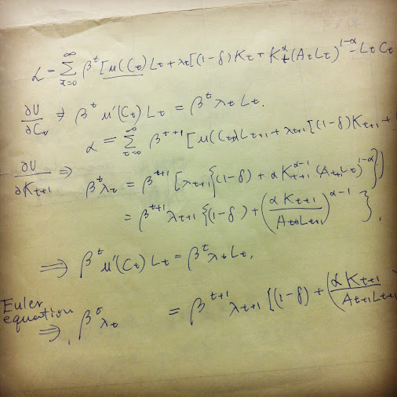

### University of Tokyo | GraSPP_Macroeconomics_2012
- Over 30 credits in advanced economics and statistics and econometrics from Economics Dept. (Literally, almost another degree in Economics)
- Plus, additional credits from Securities Law and World Bank and IMF lecture series.

